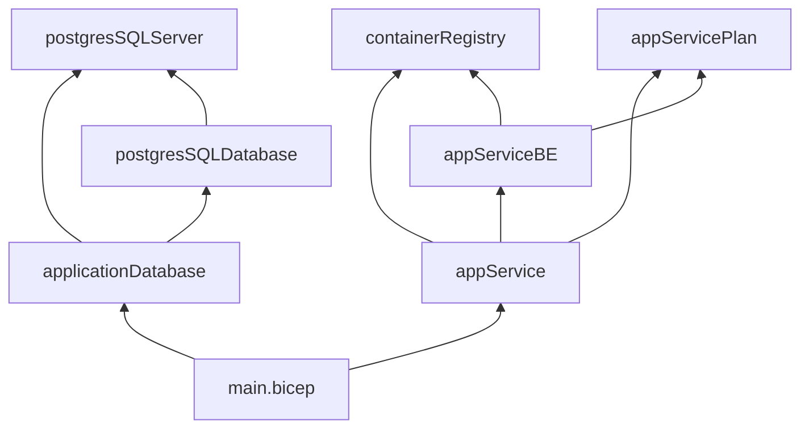

# Infrastructure Developer Documentation

## Overview

This document details the infrastructure setup, including IaC practices, resource configuration, and deployment strategies.

### Table of Contents

- [Infrastructure as Code (IaC) Strategy](#infrastructure-as-code-iac-strategy)
- [Environment Configurations](#environment-configurations)
- [Resource Modules and Bicep Files](#resource-modules-and-bicep-files)

---

## Infrastructure as Code (IaC) Strategy

> [!IMPORTANT]
> At this stage, our project deployment strategy consisted only of static apps without any containerization.

Unstructured Devlog:
> I started by looking at what services we are using at this stage and created a separate module for each of them, all the way down to the firewall, after modularizing it it proved to cause an overhead which was resovled by keeping it in our sql database server. All modules are then put together in the main bicep file. Currently modularized services are the Postgressql Server, Postgressql Database, Statkic Web Application.
> Now the infrastructure has a modularized setup with the following structure.





---

## Environment Configurations

Document the parameter files for each environment (Development, UAT, Production) and any unique settings.
> In the end our infrastructure made a decision to continue with using JSON files to specify our parameters for the infrastructure. The choice to do this was a consciuos acknowledgement of potential future migrations and easier interoperabiliyt of a JSON file comapred to the more _vendor locked_ bicep file.


This modules host variables names and value that will be used in deployment. Such as postgresSQLServerName, appServicePlanName, staticWebAppName, and more usefull variables. The environent configurations are then called in the workflow, to facilitate and modularize the diffrent naming of diffrent resources in diffrent environments.

[dev.parameters.json](https://github.com/smaswin21/Banking_Infra/blob/main/parameters/dev.parameters.json):

When we trigger the deployment to `Devellopment`, (if: github.event_name == 'push' || github.event_name == 'workflow_dispatch'. This means that every time we push on a branch we deply to dev), we start the `Deply Infrastructure (Dev)` procedure. This will, of course use DEV resource group name defined at the beginning (`RESOURCE_GROUP_DEV: BCSAI2024-DEVOPS-STUDENTS-B-DEV`), and then will call for the parameters needed for the main.bicep template. These are hosted in ./parameters/dev.parameters.json. This is the house for name of each resurce that will be deployed trought the bicep modules structure we have created.

[uat.parameters.json](https://github.com/smaswin21/Banking_Infra/blob/main/parameters/uat.parameters.json):

For UAT parameters the same appended. For example, if in dev parameter the static web app is set to money404-swa-dev. here in UAT it is set to money404-swa-uat. When in workflow we call the parameter, it will be automaticaly be created using the predefined names. Avoiding conflict and code modularization.

>[prod.parameters.json](https://github.com/smaswin21/Banking_Infra/blob/main/parameters/prod.parameters.json):
---

## Implementing Container Hosting


> Also adding modularized of infra for Linux Containers App Service, Docker Container Registry, Azure Key Vault

---

## Continuous Integration and Continuous Development

> Trying  to use the checkov tool for linting.

With Github actions and `.github/workflows/<file>.yml` we implemented Continuous Integration. This is done in each repo: [backend](https://github.com/smaswin21/Back-End-IE-Bank/blob/main/.github/workflows/ie-bank-backend.yml), [frontend](https://github.com/smaswin21/Front-End-IE-Bank/blob/main/.github/workflows/ie-bank-frontend.yml) and [infra](https://github.com/smaswin21/Banking_Infra/blob/main/.github/workflows/ie-bank-infra.yml). The triggers are consistent accros all the repos.
1. When we push to a branch that is not main, we deploy to `dev`
    ```
    if: github.event_name == 'push' || github.event_name == 'workflow_dispatch'
    ```
2. When we create a pull request to main, we deploy to `uat`
    ```
    if: github.event.pull_request.base.ref == 'main' || github.event_name == 'workflow_dispatch'
    ```
3. When we merge the pull request, we deploy to `prod`

4. Note that we also allow manual deployment to all environment with:
    ```
    github.event_name == 'workflow_dispatch'
    ```

---

## Resource Modules and Bicep Files

>Check the infra repo modules [here](https://github.com/smaswin21/Banking_Infra/tree/staticwebapp/modules)

Our infra modules directory contain Bicep templates for deploying Azure resources for the IE Bank application. The templates are organized into modular components to ensure reusability, clarity, and maintainability.

```bash
modules
├── applications            # Application services and plans
│   ├── app-service-plan.bicep
│   ├── frontend-app-service.bicep
│   └── backend-app-service.bicep
├── database                # Database resources
│   ├── postgres-sql-server.bicep
│   └── postgres-sql-database.bicep
├── infrastructure          # Shared infrastructure resources
|   ├── keyvault.bicep
│   ├── log-analytics.bicep
│   ├── log-analytics.bicep
│   └── container-registry.bicep
├── database.bicep          # Combined deployment for databases
└── website.bicep           # Combined deployment for the website frontend and backend
```

1. Install the Azure CLI: https://learn.microsoft.com/en-us/cli/azure/install-azure-cli

2. Install Bicep: https://learn.microsoft.com/en-us/azure/azure-resource-manager/bicep/install
Joint Orchestration

3. Write modules and test localy (`az bicep build --file main.bicep`)

4. The complete stack is organized by the main.bicep file in the parent directory


- **app-service-plan.bicep**
  - Deploys an Azure App Service Plan.
  - Parameters:
    - `location`: Deployment location.
    - `appServicePlanName`: Name of the App Service Plan.
    - `skuName`: SKU tier (`B1`, `F1`, etc.).

- **backend-app-service.bicep**
  - Deploys the backend service using a Docker container.
  - Parameters:
    - `location`: Deployment location.
    - `appServiceAPIAppName`: Name of the backend App Service.
    - `appServicePlanId`: ID of the associated App Service Plan.
    - `dockerRegistryUserName`, `dockerRegistryPassword`: Credentials for the container registry.
    - `appSettings`: Array of custom environment variables for the backend service.
    - `name`: Name for static web app
  - output:
    ```
    output appServiceAppHostName string = appServiceApp.properties.defaultHostName
    output staticWebAppUrl string = swa.properties.defaultHostname
    output staticWebAppEndpoint string = swa.properties.defaultHostname
    output staticWebAppResourceName string = swa.name
    ```

- **frontend-app-service.bicep**
  - Deploys the frontend service for the website.
  - Parameters:
    - `location`: Deployment location.
    - `appServiceAppName`: Name of the frontend App Service.
    - `appServicePlanId`: ID of the associated App Service Plan.
    - `appInsightsInstrumentationKey`, `appInsightsConnectionString`: Monitoring configurations.

- **postgres-sql-server.bicep**
  - Deploys a PostgreSQL Flexible Server.
  - Parameters:
    - `location`: Deployment location.
    - `environmentType`: Environment type (`nonprod`, `prod`).
    - `postgresSQLServerName`: Name of the PostgreSQL server.

- **postgres-sql-database.bicep**
  - Deploys a database within an existing PostgreSQL server.
  - Parameters:
    - `postgresSQLServerName`: Name of the existing PostgreSQL server.
    - `postgresSQLDatabaseName`: Name of the database to create.

- **keyvault.bicep**
  - Deploys an Azure Key Vault.
  - Parameters:
    - `location`: Deployment location.
    - `keyVaultName`: Name of the Key Vault.
    - `roleAssignments`: Array of role assignments for the Key Vault.

- **log-analytics.bicep**
  - Deploys a Log Analytics Workspace.
  - Parameters:
    - `location`: Deployment location.
    - `name`: Name of the Log Analytics Workspace.

- **app-insights.bicep**
  - Deploys an Application Insights resource.
  - Parameters:
    - `location`: Deployment location.
    - `appInsightsName`: Name of the Application Insights resource.
    - `logAnalyticsWorkspaceId`: ID of the associated Log Analytics Workspace.

- **container-registry.bicep**
  - Deploys an Azure Container Registry.
  - Parameters:
    - `location`: Deployment location.
    - `registryName`: Name of the container registry.
    - `sku`: SKU tier (`Basic`, `Standard`, `Premium`).
    - `logAnalyticsWorkspaceId`: This is the id of our log analytics for the container registry to use via the diagnostics


- **database.bicep**
  - Combined deployment for databases
  - Parameters:

- **website.bicep**
  - orchestrates the deployment of the entire website, including both frontend and backend applications.
  - Resources Deployed
    1. Backend Service: Deployed via the backend-app-service.bicep module.
    1. Frontend Service: Deployed via the frontend-app-service.bicep module.
    1. App Service Plan: Shared between frontend and backend.
    1. Container Registry: Used for storing backend Docker images.
    1. Monitoring: Includes Application Insights and Log Analytics.
  - Parameters:
    - environmentType: Environment type (nonprod, prod).
    - location: Deployment location.
    - containerRegistryName: Name of the Azure Container Registry.
    - appServiceAppName, appServiceAPIAppName: Names of the frontend and backend services.


### Static Web App Deployment

Static Web Apps are an excellent way to host front-end applications (HTML, CSS, Vue, etc.) at a significantly lower cost. They provide a simple and efficient solution for hosting static content.

#### Initial Approach: Using Online Modules

Initially, we explored using an Azure-provided online module (`module staticWebApp 'br/public:avm/res/web/static-site:0.3.0'`) for deploying the Static Web App. However, this approach introduced several challenges:

- **Complexity**: Incorporating the module into our Bicep folder structure was cumbersome.
- **Dependency**: It tied us to an external template, making future modifications or customizations more difficult.

#### Final Approach: Local Template Hosting

To overcome these limitations, we decided to host the template locally. We created a custom Bicep module, `frontend-app-service.bicep`, to deploy our Static Web App. This allowed us to streamline the deployment process and fully control the template's behavior.

You can find the code for the custom module here:
[**frontend-app-service.bicep**](https://github.com/smaswin21/Banking_Infra/blob/main/modules/applications/frontend-app-service.bicep).

## Deployment Process

We followed Azure's official documentation to integrate the Static Web App into our structure. Here's how we set it up:

1. **Parameterization**:
   - We defined key parameters for deployment, including:
     - **Static Web App Name**: e.g., `money404-dev-swa`, `money404-uat-swa`, `money404-prod-swa`.
     - **SKU**: Free, Standard, etc.
     - **Location**: e.g., West Europe.

   These values are stored in environment-specific parameter files (e.g., `dev.parameters.json`) to ensure flexibility across environments.

2. **Module Integration**:
   In the `main.bicep` file, we call the `frontend-app-service.bicep` module and pass the required parameters. This ensures the Static Web App is deployed consistently across environments.

3. **Frontend Configuration**:
   After deploying the Static Web App, we pass its token to the front-end application. This token ensures that the front-end is hosted in the correct Static Web App instance.

---

By hosting the template locally and integrating it into our existing Bicep structure, we simplified the deployment process while maintaining full control over the configuration.
