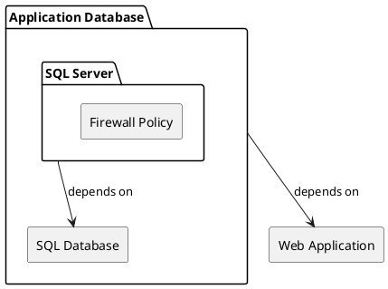

# Infrastructure Developer Documentation

## Overview

This document details the infrastructure setup, including IaC practices, resource configuration, and deployment strategies.

### Table of Contents

- [Infrastructure as Code (IaC) Strategy](#infrastructure-as-code-iac-strategy)
- [Environment Configurations](#environment-configurations)
- [Resource Modules and Bicep Files](#resource-modules-and-bicep-files)

---

## Infrastructure as Code (IaC) Strategy

> [!IMPORTANT]
> At this stage, our project deployment strategy consisted only of static apps without any containerization.

Unstructured Devlog:
> I started by looking at what services we are using at this stage and created a separate module for each of them, all the way down to the firewall, after modularizing it it proved to cause an overhead which was resovled by keeping it in our sql database server. All modules are then put together in the main bicep file. Currently modularized services are the Postgressql Server, Postgressql Database, Statkic Web Application.
> Now the infrastructure has a modularized setup with the following structure.

---

## Environment Configurations

Document the parameter files for each environment (Development, UAT, Production) and any unique settings.

---

## Implementing Container Hosting

> Also adding modularized of infra for Linux Containers App Service, Docker Container Registry, Azure Key Vault

---

## Continuous Integration and Continuous Development

---

## Resource Modules and Bicep Files

Provide links to each Bicep module and a description of its purpose and configurations.
